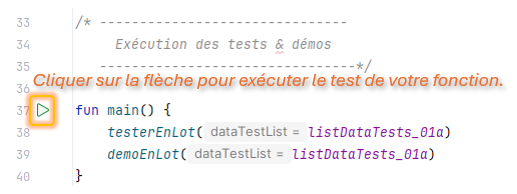

# Exercices d'algorithme & d'implémentation en Kotlin

## Présentation :

Vous trouverez dans le dossier `src/kotlin` une liste de sous-dossiers comportant plusieurs exercices sur une thématique définie :

- **`_01_Les_basiques` :** Série d'exercices s'appuyant tous sur le parcours d'une liste avec boucle d'itération afin de  trouver une valeur ou de réaliser une agrégation des valeurs de la liste pour calculer une valeur unique (ex: calculer la moyenne d'une série de valeurs).
- **`_02_Les_classiques` :** 2 algorithmes classiques sont à traiter dans ce dossier : 
  - La recherche par dichotomie
  - Le tri par sélection
- **`_03_Manipulation_dans_une_liste` :** Dans cette d'exercices vous devrez supprimer et/ou déplacer les valeurs d'une copie de la liste.
- **`_04_Autres` :** Une série d'exercices non centrés sur les listes et/ou répondant à des problèmes classiques.

## Procédure à suivre

Pour chacun des dossiers thématiques vous trouverez un fichier au format ***Markdown*** (***.md***) qui exposera le travail à réaliser et donnera une explication des algorithmes à implémenter.

Tous les exercices sont accompagnés d'exemples, ce qui permet :
- Le test par assertion de l'ensemble des programmes.
- La démonstration du travail réalisé.

Chaque exercice comporte sa fonction `main()`, il est ainsi possible d'exécuter indépendement chaque fonction.

