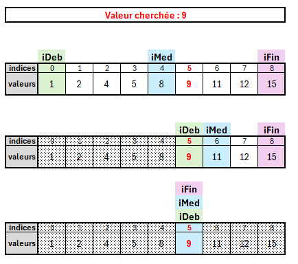
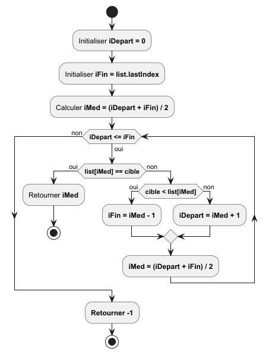
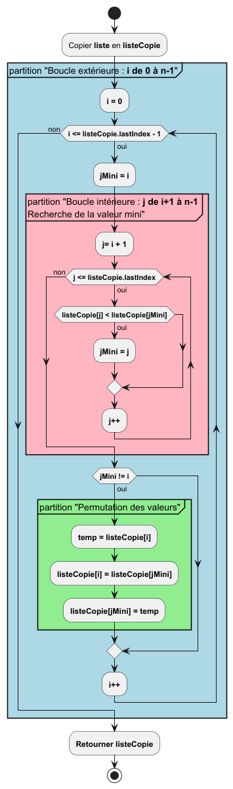

# SUJET 02 : Les classiques

## Présentation générale :
Cette partie propose deux algorithmes faisant partie de la culture algorithmique et informatique.

## Sujet 02-a : La recherche dichotomique

### Présentation de l'algorithme :
Rechercher une valeur dans une collection comme une liste est un problème courant en informatique. Un aglorithme relativement performant pour réaliser cette tâche est l'algorithme de recherche par dichotomie. C'est un algorithme qui applique la stratégie : *"Diviser pour régner"* ou en anglais *"Divide and conquer"*. L'idée est de diviser/scinder les données à traiter en sous-unités à traiter indépendamment.
Pour creuser le sujet, vous pourrez consulter l'article sur Wikipédia : https://fr.wikipedia.org/wiki/Diviser_pour_régner_(informatique)

Pour la recherche dichotomique l'objectif est de trouver une valeur dans une liste qui est **obligatoirement triée**.

La stratégie appliquée va permettre de réduire par deux le domaine de recherche à chaque itération.

<u>**Illustration :**</u>

Nous avons une liste avec les valeurs `[1, 2, 4, 5, 8, 9, 11, 12, 15]` et nous cherchons la valeur **9**.
- **1ère itération :** La recherche se fait sur tous les indices de la liste : **iDeb = 0** et **iFin = 8** et on vérifie si la valeur cherchée est au centre **iMed = 4**.
- **2e itération :** **iDeb** est placé juste à droie du **iMed** précédent et on place **iMed** sur l'indice n°6.
- - **3e itération :** **iFin** est placé juste à gauche de **iMed** alors que **iMed** est placé au centre à l'indice n°5.

### Travail à réaliser :

Compléter la fonction `rechercheDichotomique(cible: Int, list: List<Int>): Int` qui prend en 1er argument une valeur entière à rechercher dans la liste d'entiers triée dans l'ordre croissant  du 2e argument. La fonction retourna un entier qui aura pour valeur **-1** la valeur recherchée est absente et l'indice de la valeur recherchée. Si la valeur est représentée plusieurs fois, aucune exigence n'est spécifiée sur le choix de l'occurrence à retourner.

Pour vous aider à implémenter l'algorithme, nous vous donnons sa représentation sous forme d'un diagramme UML d'activité : 

### EXEMPLE 1 :
* Valeur cible : 5
* Liste donnée : [2, 3, 5, 7, 8, 11]
* Résultat : 2

### EXEMPLE 2 :
* Valeur cible : 3
* Liste donnée : [3, 7, 8, 9, 13, 15]
* Résultat : 0

### EXEMPLE 3 :
* Valeur cible : 18
* Liste donnée : [3, 7, 8, 9, 15, 18]
* Résultat : 5

### EXEMPLE 4 :
* Valeur cible : 10
* Liste donnée : [3, 7, 8, 9, 15, 18]
* Résultat : -1

## Sujet 02-b : Algorithme de tri par sélection

### Présentation de l'algorithme :
Le tri de liste est une tâche fondamentale. Par exemple, l'algorithme de recherche dichotomique du problème précédant a besoin de listes triées pour fonctionner.

Il existe de nombreux algorithmes de tris ayant des performances variables. Si vous êtes curieux sur le sujet la vidéo suivante illustre la performance des principaux algorithmes de tri : https://www.youtube.com/watch?v=kPRA0W1kECg

Nous vous proposons d'implémenter le plus simple des algorithmes de tri : **le tri par sélection**.

Cet algorithme de tri repose sur deux boucles :
* Une boucle principale
* Une boucle de recherche de la valeur minimale

La liste va être segmentée en 2 partie durant le processus :
* La partie de gauche accueille les valeurs triées.
* La partie de droite contient les valeurs non triées.

Dans la boucle principale, on récupère la valeur minimale dans la plage de valeurs non triées. Puis, on réalise une permutation entre la valeur mini trouvée et la 1ère valeur non triée.

Pour illustrer cela nous vous proposons quelques ressources à consulter qui comporte les images et animations pour mieux appréhender le déroulement de l'algorithme :
* https://fr.wikipedia.org/wiki/Tri_par_sélection
* http://lwh.free.fr/pages/algo/tri/tri_selection.html

### Travail à réaliser :

Compléter la fonction `triParSelection(liste: List<Int>): MutableList<Int> `. Elle prend en argument une liste à trier et retourne une copie de la liste triée.

Pour vous aider à implémenter l'algorithme, nous vous donnons sa représentation sous forme d'un diagramme UML d'activité :

### EXEMPLE 1 :
* **Argument :** `[11, 3, 5, 8, 7, 2]`
* **Donne en résultat :** `[2, 3, 5, 7, 8, 11]`

### EXEMPLE 2 :
* **Argument :** `[15, -5, 13, 9, 8, 7]`
* **Donne en résultat :** `[-5, 7, 8, 9, 13, 15]`

---

## Sujet 02-b : Tri par sélection

Nous avons vu précédement l'algorithme de recherche par dichotomie. Or pour que cet algorithme puisse s'appliquer il est nécessaire que la liste soit triée.

Nous allons vous demander d'implémenter dans cet exercice un algorithme basique de tri : *tri par sélection*.

### Présentation de l'algorithme :

### Travail à réaliser :

### EXEMPLE 1 :
- **Liste de départ :** `[11, 3, 5, 8, 7, 2]`
- **Liste triée :** `[2, 3, 5, 7, 8, 11]`

### EXEMPLE 2 :
- **Liste de départ :** `[15, -5, 13, 9, 8, 7]`
- **Liste triée :** `[-5, 7, 8, 9, 13, 15]`
